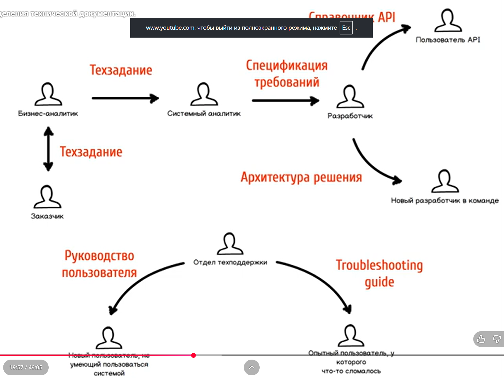

# Два определения технической документации

## Что такое документация?

**Стейкхолдеры (stakeholders) - это значимые участники проектной команды. Между ними есть каналы связи.**

#### Виды коммуникации:

- интерактивные (realtime communications)
- неинтерактивные (push communications)
- пассивные, или "по запросу" (pull communications)

### Интерактивные (realtime communications)

_Телефонный разговор, чат, личная встреча..._

- быстрые вопросы и немедленные ответы
- нет времени на подумать
- для решения срочных вопросов

### Неинтерактивные (push communications)

_Email, системы техподдержки..._

- не требуют немедленного ответа
- есть выозможность подумать над ответом
- для несрочных вопросов

### Пассивные, или "по запросу" (pull communications)

_Базы знаний, wiki-системы, комплекты документации, индустриальные стандарты, онлайн-курсы, видеоинструкции..._

- информация уже выложена, читатель сам найдет ответ
- самый медленный способ коммуникации

**Техническая документация - пассивный (pull) способ реализации канала коммуникации между двумя четко определенными стейкхолдерами проекта.**

_Структура коммуникаций стейкхолдеров..._

Многие реализации этих каналов связи можно сделать устно.

**Документация возникает тогда, когда остальные способы реализации этого канала коммуникации слишком дороги.**

## Парадокс документации как коммуникации

- Pull-коммуникация — самая дорогая. Push и realtime, чаще всего, дешевле
- Документация возникает в краевых случаях дороговизны push- и realtime-коммуникации для **конкретной пары стейкхолдеров**

### Когда pull лучше, чем push и realtime?

- Когда количество "получателей" коммуникации велико
- - Сотни тысяч пользователей
- - Проектная команда из 40 разработчиков
- Когда стоимость ошибки велика
- - Ошибка в устрой передаче требований приведет к дорогой переделке системы

### Документация требует инвестиций

- Ее нужно сесть и написать
- Ее нужно тестировать и профилировать — действительно ли она хорошо реализует эттот канал коммуникации?
- Ее нужно поддерживать в актуальном состоянии

### Еще одно определение технической документации

Техническая документация — это набор **текстовых материалов**, описывающих разные аспекты программного продукта:

- **создания**,
- **внутреннего устройства**,
- **и эксплуатации**

#### Создание продукта

- Project vision
- Техзадания и спецификации требований
- Проектные планы
- Roadmap-ы развития продукта
- Бэклоги фич
- Планы на спринт

#### Внутреннее устройство продукта

- Архитектура программного решения
- Описание инфраструктуры
- Инструкции по развертыванию рабочего окружения

#### Использование продукта

- Руководство пользователя и администратора
- Справочники API
- Инструкии по инсталяции
- "How to contribute"

#### Подведение итогов

- Документация — способ реализации канала pull-коммуникации между проектными стейкхолдерами
- Эта коммуникация освещает аспекты создания, использования или внутреннего устройства продукта
- Этот способ реализации канала коммуникации дешевле, чем push или realtime
- Этот канал коммуникации реализуется текством и изображениями

## Как сделать так, чтобы документация появилась?

- Нарисуйте карту стейкхолдеров
- Определите, какие каналы стоит реализовать в виде документации
- Напишите документацию для каждого из каналов

### Канал коммуникации = документ?

- Кто оба стейкхолдера (говорящий и принимающий)?
- Зачем вообще реализовывать этот канал коммуникации? Зачем он проекту? А бизнесу?
- Точно ли документация — самый дешевый способ реализации этого канала?

### Реализация канала коммуникации

- Каков контекст принимающего стейкхолдера? Что он знает и чего он не знает?
- Что именно хочет сообщить "говорящий" стейкхолдер? Какие еще есть источники информации?
- Как это правильно структурировать, написать и оформить?

### Технический писатель как имплементатор канала коммуникации

- Понять нужды стейкхолдеров
- Собрать, изучить и структурировать информацию
- Спроектировать ее текстовое представление (чтобы канал коммуникации был реализован эффективно)
- Написать понятный и грамотный текст

! [Примеры возможных документов](./images/подборка_возможных_документов.png)
_Подборка возможных документов..._

**Документация — это про деньги.**

Эффективно реализованный канал коммуникации экономит трудозатраты и снижает риски.

### Подытожим

- Документация - способ реализации канала коммуникации между стейкхолдерами
- Не каждый канал должен быть реализован документацией
- Техписатель - имплементатор этого канала
- Документация - это про деньги

## Полезная и справочная литература

1. A Guide to the Project Management Body of Knowledge (PMBOK Guide) Fifth Edition - справочник
