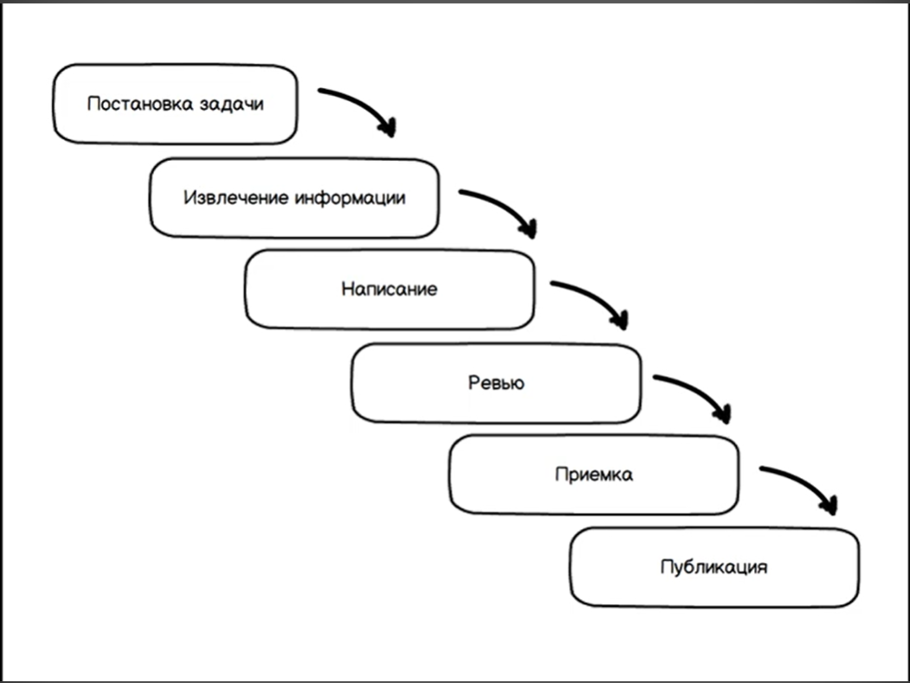

# Жизненные циклы технических документов

**Техническая документация** — это **pull**-способ реализации канала **коммуникации** между **проектными стейкхолдерами**, описывающий аспекты

- **создания**,
- **эксплуатации**,
- **или внутреннего устройства**
  програмного продукта, и реализуемый **текстом и/или графикой**.

**Технический документ** — это **проектный артефакт** технической документации, связывающий **двух определенных стейкхолдеров** и являющийся **обособленной единицей** в терминах

- **целеполагания**,
- **контроля качества**,
- **и публикации**.

**_Артефакт = процесс вокруг него = жизненный цикл_**

## Жизненный цикл технического документа

**Примерный жизненный цикл документа**

### Постановка задачи
- Каких двух стейкхолдеров мы связываем?
- Зачем это им?
- Зачем этот канал коммуникации бизнессу?

### Извлечение информации

#### Интервьирование стейкхолдеров

##### Готовимся к интервью
- Точно ли мы говорим с парой стейкхолдеров? (а не с менеджерами, например)
- Точно ли оба стейкхолдера понимают, о каком канале коммуникации идет речь?
- Точно ли оба стейкхолдера понимают, что мы облегчаем им жизнь?

##### Интервью
__"Мы сейчас настраиваем канал коммуникации между вами, чтобы..."__

Вопрос к рассказывающей стороне: **"О чем вы хотели бы расскахать?"**
Вопрос к слушающей стороне: **"Что вы хотели бы услышать?"**

### Написание документа
- Наиболее эффективная реализация канала коммуникации с учетом нужд стейкхолдеров
  - Весь фронт информации
  - Структура
  - Стиль
  - Язык

### Проверка документа
- Верна и полна ли изложена информация?
- Хорошо ли всё структуризировано? Читаемо ли?
- Есть ли орфографические ошибки?
- Хорошо ли оформлено?

Термин проверки документов в разны компаниях может называться по разному.
Например:
- Вычитка
- Редактура
- Корректура
- Фактчекинг
- Проверка

Отличный термин, который можно подобрать в нашей специфике работы - это **Ревью**.

**Ревью - процесс с множеством участникв**
**И множеством итераций**
