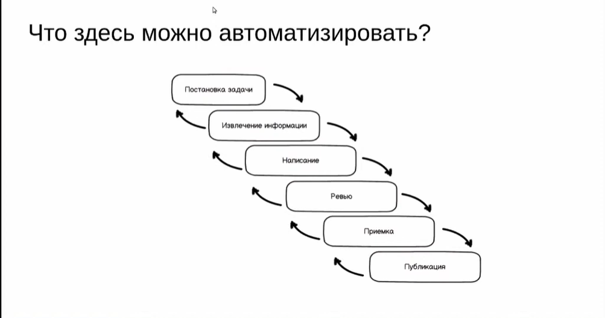
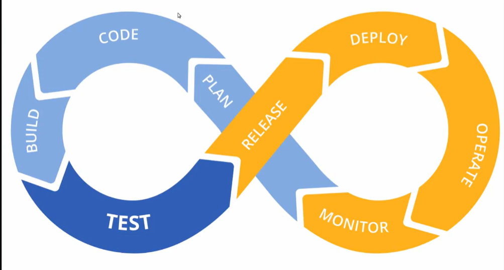

# Введение в DocOps

*Об этом термине важно знать всем техническим писателям*

Что из этого должен делать человек? А что можно и нужно отдать машине?

## DevOps

**Культура, процессы и инструменты разработки ПО**

- Взаимодействие Dev & Ops
- Интеративная разработка
- Автоматизация (рутину - роботам!)
- Всё как код

## DocOps

Doc & Ops? *Нет*\
Скорее, **DevOps x Docs**

- Взаимодействие Doc и всех остальных
- Итеративная разработка
- Рутину — роботам
- Всё как код

### Code: документация как код

Легковесный язык разметки: для машины и для человека.

Хранение в СКВ (git) дает нам:

- Версионирование
- Ветки
- Diffability
- Blameability
- Трассировку изменений к задачам

### Build

#### Форматы -> инструменты

Из исходников получаем документацию в формате, который читает пользователь

- Статический сайт
- PDF, DOCX, EPUB, CHM (!)
- Поставка вместе с приложением
- Публикация в wiki или CMS

#### Принципы

- Рутину — роботам
- Один источник, много форматов
- Оформление != содержание
- Возможно, несколько источников: разные репозитории, автогенерация из кода, UGC, что угодно

#### JAMStack

JAM = JavaScript, API, Markups

- [https://jamstack.org/](https://jamstack.org/)
- [https://jamstackconf.com/](https://jamstackconf.com/)

### Test — это рецензирование (ревью)

#### Пирамида тестирования

Уже есть в разработке документации:

1. Peer reviev
2. SME
3. Заказчик документа

Добавляем к пирамиде работу роботов:

1. Синтаксис языка разметки
2. Тестирование исходного текста: линтеры и автотесты
3. (Сборка и будликация в тестовом окружении)

Человеческое ревью тоже меняется:

- Пулл-реквест
- Опираемся на дифф, результаты тестов и тестовую публикацию
- Приёмка — это approve в пулл-реквесте

### Release — приемка

- Подстверждение (approve) в пулл-реквесте
- Снимается, если появилиись изменения
- Подтвержденный PR можно мерджить (git merge)

### Deploy — публикация

Доставка документации туда, где её будут читать пользователи.

### Operate — поддержка

К нам особо не относится.

### Monitor — аналитикаи обратная связь

Показатели на уровне сайта:

- Как поживает сервер? - отдаем админам
- Производительность страниц - позовите фронтендеров

Показатели на уровне документации:

- Сколько читают?
- Что читают?
- Помогло или нет?

Показатели на уровне бизнесса:

- Дефлексия от техподдержки
- Прямые продажи
- Upsale

### Plan — постановка задачи

Задачи особо не меняются. Может потребоваться делать отдельную ветку в СКВ.

## Смысл и польза

- Уменьшаем time to market
- Уменьшаем рутину, которая съедает силы
- Увеличиваем прозрачность и трассируемость работы
- Shift left в проверке качества документации
- Общие инструменты и процессы с разработчиками
